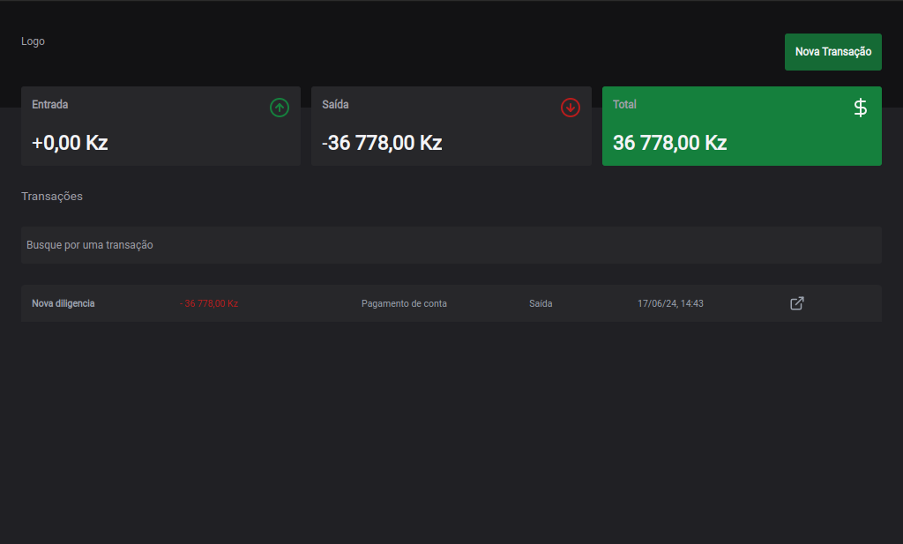

# Projeto de Controle Financeiro





Este projeto tem como objetivo fornecer uma ferramenta para calcular e monitorar entradas e saídas financeiras. Os usuários podem inserir detalhes das suas transações, categorizá-las, definir a quantia envolvida e especificar se a transação é uma entrada ou uma saída. Além disso, é possível filtrar e visualizar transações específicas conforme a necessidade.

## Funcionalidades

1. **Cadastro de Transações**:
   - **Descrição**: Campo para o usuário inserir a descrição detalhada da transação.
   - **Categoria**: Campo para o usuário categorizar a transação (e.g., alimentação, transporte, lazer).
   - **Quantia**: Campo para o usuário inserir o valor da transação.
   - **Tipo de Transação**: Campo para o usuário especificar se a transação é uma "Entrada" ou uma "Saída".

2. **Visualização de Transações**:
   - Listagem de todas as transações registradas com detalhes de descrição, categoria, quantia e tipo de transação.
   - Resumo financeiro mostrando o total de entradas, saídas e saldo atual.

3. **Filtragem de Transações**:
   - Filtro por **Categoria**: Permite ao usuário visualizar transações de uma categoria específica.
   - Filtro por **Tipo de Transação**: Permite ao usuário visualizar apenas entradas ou apenas saídas.

    ## Instruções para Execução

Siga os passos abaixo para executar o projeto localmente.

### Pré-requisitos

Certifique-se de ter o Node.js e o npm (Node Package Manager) instalados no seu sistema. Você pode baixar o Node.js (que inclui o npm) no [site oficial do Node.js](https://nodejs.org/).

### Passo a Passo

1. **Criar o Projeto com Vite**

  Clone o repositório do GitHub para o seu computador local:

   ```bash
   git clone https://github.com/Amiltonxavier/dt-money.git
   
   cd robofriends 
   ```
2. Instale as dependências do projeto:

```bash
  npm install
```

3. Execute a aplicação em desenvolvimento:

```bash
    npm run dev
```

